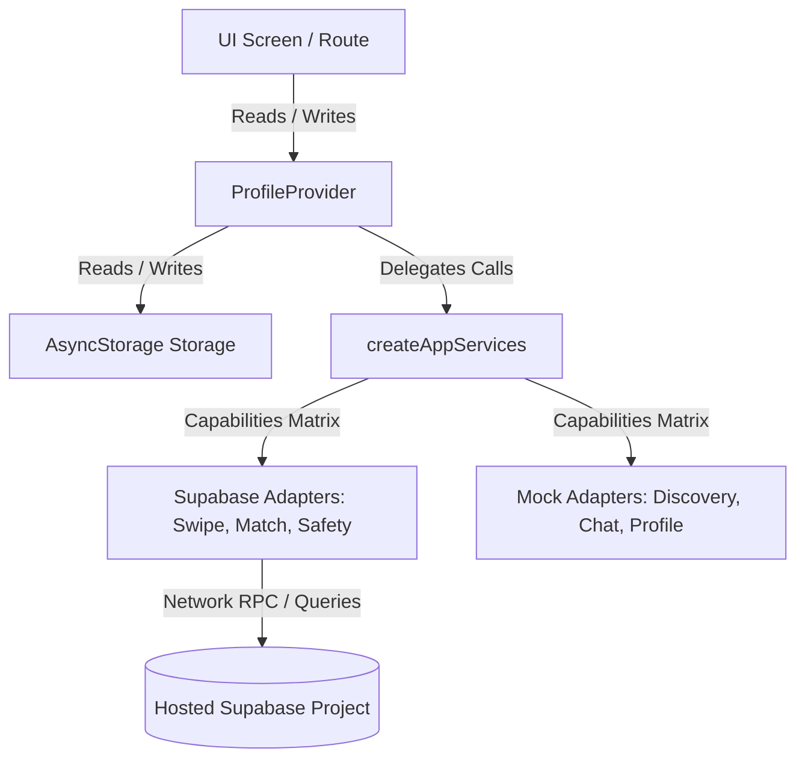

# Project Review & Architecture Audit: Orchard App (2026-06-20)

This document provides a comprehensive technical review of the Orchard repository, evaluating its current state, system architecture, scaffolding, and code quality. Orchard is an iOS-first Expo React Native prototype migrating toward a Supabase-backed MVP for polyamorous/ENM (Ethical Non-Monogamy) dating.

**Audit Date:** 2026-06-20

---

## 1. Executive Summary

Orchard’s core product wedge—**structured relationship-context matching**—is a refreshing departure from generic swiping clones. By presenting relationship structure, partnered status, lookings, boundaries, and compatibilities upfront, it addresses the specific friction points of the polyamorous and ENM dating community.

### Current Phase Assessment (As of 2026-06-20)
The project is in the **pre-integration transition phase**:
*   **Frontend UI:** Mostly complete and highly functional local prototype utilizing `AsyncStorage` and simulated interactions (like simulated chat auto-replies).
*   **Backend Foundation:** Robust Supabase schema draft, security-hardened RLS policies, custom PostgreSQL RPC functions, and a pgTAP-based local database testing suite (19/19 tests passing).
*   **Adapter Layer:** Service boundaries (`SwipeService`, `SafetyService`, etc.) are established, allowing the client to consume mock adapters or Supabase adapters via an environment-gated factory.

---

## 2. Architecture & System Design Analysis

Orchard utilizes a decoupled service architecture that facilitates an incremental, non-breaking transition from local mock state to a real cloud database.



### Key Architectural Strengths
1.  **Capabilities-Driven Service Factory (`app-services.ts`):** 
    The `createAppServices` factory determines whether to spin up a mock adapter or a real Supabase adapter on a per-service basis. This design enables developers to wire up one backend service at a time (e.g., swipes and safety first) without breaking the rest of the application.
2.  **Explicit Service Boundaries (`services/`):** 
    All domain logic is mapped to TS interfaces (e.g., `ProfileService`, `SwipeService`). Screens and providers interact with these interfaces rather than raw database clients, making mock/real substitutions seamless.
3.  **Security-Definer RPC Boundary:** 
    Rather than allowing client-side write access to critical tables like `matches`, `blocks`, `reports`, and `account_deletion_requests`, the architecture routes all mutations through database-level RPCs. The database handles actor identity verification using `auth.uid()`, eliminating identity spoofing risks.

---

## 3. Project Scaffold Review

The scaffolding is clean, standard for modern Expo projects, and adopts robust developer tooling.

### Directory Structure Evaluation
*   **`docs/`:** Exceptionally well-documented. Having a session-handoff, project status, migration plan, and gap assessment helps incoming developers or AI agents get context instantly.
*   **`supabase/`:** Houses the CLI configuration, pgTAP tests, and migration scripts. Separating this from the `expo/` folder keeps mobile client builds lighter.
*   **`expo/app/`:** Utilizes file-based routing via **Expo Router v6**. The file paths match tab layouts and modal navigations.
*   **`expo/providers/`:** Split into three clear context boundaries: `QueryClientProvider`, `AuthProvider`, `ProfileProvider`, and `OnboardingProvider` (nested in onboarding layout).

### Package Dependencies (`package.json`)
*   **React 19 & React Native 0.81.5:** The project uses the latest stable React features.
*   **Zustand & React Query:** React Query (`@tanstack/react-query`) is used for AsyncStorage operations. Zustand is installed but not heavily utilized.
*   **Bun Package Manager:** Bun is set up as the primary lockfile owner (`bun.lock`), ensuring very fast install and dependency resolution times.

---

## 4. Code Review & Quality Assessment

### A. Critical Gap: The Couple Profile Database Mismatch
During my audit of the onboarding flow and the database schema, I discovered a **critical schema-app design mismatch**:

1.  **Client Representation:** 
    In the React Native app, `Profile` (defined in [types/index.ts](file:///c:/Users/skfja/Projects/orchard_app/expo/types/index.ts#L371-L390)) represents a couple by storing an array of two individuals in the `people` field:
    ```typescript
    export interface Profile {
      accountType: "single" | "couple";
      people: PersonProfile[]; // length 1 or 2
      ...
    }
    ```
    Each `PersonProfile` has its own name, age, gender, orientation, interests, voice prompts, and photo lists.
2.  **Database Representation:** 
    In the initial schema migration ([202606190001_initial_mvp_schema.sql](file:///c:/Users/skfja/Projects/orchard_app/supabase/migrations/202606190001_initial_mvp_schema.sql#L9-L34)), the `public.profiles` table is 1-to-1 with `auth.users` and uses **single-value columns**:
    ```sql
    create table if not exists public.profiles (
      id uuid primary key references auth.users(id),
      display_name text,
      birthdate date,
      gender text,
      orientation text,
      bio text,
      ...
    );
    ```
3.  **The Consequence:** 
    If a couple registers, the database schema cannot store the individual names, birthdates, genders, orientations, or bios of both members. Furthermore, in the `public.profile_photos` table, photos are associated directly with the `profile_id` without specifying which photo belongs to which member of the couple.

### B. React State & Context Bloat (`ProfileProvider`)
At **825 lines**, `ProfileProvider` ([profile-provider.tsx](file:///c:/Users/skfja/Projects/orchard_app/expo/providers/profile-provider.tsx)) has grown too large. It is currently acting as a monolithic state controller that mixes:
*   Local state hydration/dehydration (AsyncStorage & React Query mutations).
*   Discovery card swiping logic (like/pass/superlike tracking).
*   Simulated chat timers, message/photo sending, and read notifications.
*   Monetization counters, purchase calculations, and subscription actions.
*   Couple partner invitations/links.

**Risk:** As real Supabase services are wired, this file will become increasingly complex, harder to test, and prone to unnecessary component re-renders.

### C. Client Security & Data Protection
*   **Excellent Environment Gating:** The app checks for `EXPO_PUBLIC_SUPABASE_URL` and `EXPO_PUBLIC_SUPABASE_ANON_KEY` to run in Supabase vs. Mock mode.
*   **Sensitive Data Guarding:** `.env.example` lists the required keys and explicitly cautions against checking in service-role keys.
*   **Privacy compliance:** Legal config is correctly bound to environment variables. Chat feeds are blocked for non-matches.

### D. Hardened Database Security & RLS
The database design is highly secure:
*   **Explicit Column Grants:** Authenticated users can only update user-facing columns. Column-level permissions prevent users from modifying columns like `is_suspended` directly.
*   **Robust Policies:** Row-Level Security (RLS) policies are correctly configured. Functions like `private.is_discoverable_profile` prevent suspended or blocked profiles from showing up.
*   **Bidirectional Blocking:** RPCs ensure blocks immediately set existing matches to `'blocked'` andBidirectionally hide profiles from discovery.

---

## 5. Areas for Improvement & Recommendations

Here is where the project can be improved as it migrates from prototype to MVP:

### 1. Resolve the Couple Profile Schema Mismatch (High Priority)
Before applying the migration to `orchard-dev`, choose one of the following schema models:

*   **Option A: Normalization (Recommended)**
    Extract individual user profiles into a `profile_members` table:
    ```sql
    create table public.profile_members (
      id uuid primary key default gen_random_uuid(),
      profile_id uuid not null references public.profiles(id) on delete cascade,
      display_name text not null,
      birthdate date not null,
      gender text,
      orientation text,
      bio text,
      sort_order int not null default 0
    );
    ```
    Add a `member_id uuid references public.profile_members(id)` column to `profile_photos` to link photos to the correct member.
*   **Option B: Denormalized Columns**
    If the MVP must remain simple, add optional `person_b_*` columns directly to `profiles` (e.g., `display_name_b`, `gender_b`, etc.) and add a `member_index int` to `profile_photos`.
*   **Option C: Multi-Account Linking**
    Keep each user's account separate (1-to-1 with `auth.users`), but link them via a `partner_links` table. When matching, query both linked accounts and display them together. (This fits the existing local `linkedPartners` UI logic well).

### 2. Refactor and Split `ProfileProvider` (Medium Priority)
Before wiring profiles to Supabase:
*   **Decouple Chat State:** Move conversation history, drafting, and typing states into a dedicated `ChatProvider` or a custom `useChat()` hook.
*   **Decouple Monetization:** Move purchase, billing, and subscription handlers to a `BillingProvider`.
*   **Utilize Zustand:** Since Zustand is already a dependency in `package.json`, use it to store global cache states (like matching decks, unread counts, and active matches), keeping React Contexts lightweight.

### 3. Polish the Android Configuration
The app is iOS-first, but since it is built with Expo, it will eventually run on Android. Currently, in [app.json](file:///c:/Users/skfja/Projects/orchard_app/expo/app.json#L25), the Android package name is still the Rork default template:
```json
"android": {
  "package": "app.rork.h12kndiz6neur3chkh3q1"
}
```
*   **Recommendation:** Change the Android package name to `com.orchardapp.android` (or similar) to match the custom iOS bundle identifier `com.orchardapp.ios`.

### 4. Implement CI/CD and Automatic Database Testing
Since you have pgTAP tests written, you can easily integrate them into a local workflow or a GitHub Actions runner:
*   Add a test script to `package.json` that boots the Supabase CLI docker image and runs `supabase test db`.
*   Configure a GitHub Actions workflow to run lint, typecheck, and database tests on every Pull Request to ensure RLS rules are never broken by subsequent schema modifications.
