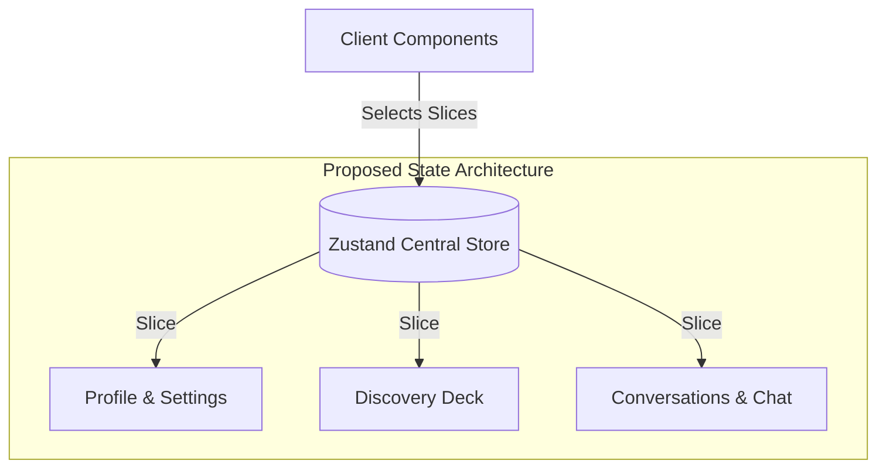
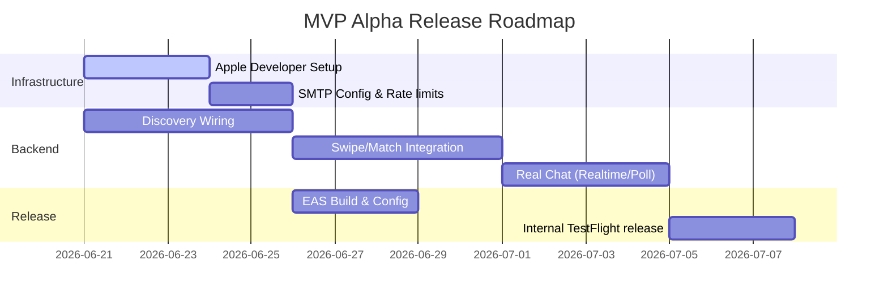

# Orchard Repo Audit, Best Practices & MVP Release Roadmap (2026-06-21)

This document provides a comprehensive technical audit of the Orchard repository, guidelines for engineering and product management best practices, and a tactical roadmap for launching the MVP to close friends and testers.

---

## 1. Repository Audit (Current State)

Orchard has evolved from a static clickable UI prototype into a partially integrated, database-backed application. Here is a summary of the current system boundaries as of June 21, 2026:

### Integrated Systems (Wired to Hosted Supabase `orchard-dev`)
*   **Authentication:** Real email/password signup and sign-in are wired. The client handles web confirmation redirects (`?code=` and hash tokens), routes users to a pending-confirmation state, and safely handles edge cases (such as restoring onboarding progress from a local draft after a browser tab refresh).
*   **Profile Persistence:** Users and profiles are split into `profiles` (global account metadata and preferences) and `profile_members` (representing 1 or 2 people for single/couple accounts). This resolves the single/couple schema mismatch. Onboarding completes by writing these records to the backend.
*   **Photo Storage:** Profile photos selected during onboarding are uploaded to a private Supabase Storage bucket (`profile-photos`) with owner-scoped policies. Signed URLs are hydrated on profile load.
*   **Database Testing:** Local testing is robust. A pgTAP suite runs 38 tests locally covering RLS policies, table grants, security-definer RPC write gates (safety, blocks, unmatch, swipes), and profile constraints.

### Prototype Systems (Remaining Mock/Local)
*   **Discovery Deck:** The swipe cards are pulled via a local `DiscoveryService` that reads from `MOCK_PROFILES` and filters out passed/liked IDs. The backend is not yet queried for discovery.
*   **Reciprocal Swipe & Matching:** Swiping right creates an immediate local match in AsyncStorage instead of writing to the backend `swipes` table and waiting for a reciprocal match.
*   **Chat Messaging:** Messages and conversations are stored locally in AsyncStorage. Auto-replies are generated with fake timers (`setTimeout`).

---

## 2. Product Management Best Practices

To make Orchard a success in the niche Polyamorous & Ethical Non-Monogamy (ENM) market, focus the product roadmap around the core matching wedge rather than generic swiping.

### A. Focus on the Structured Matching Wedge
Traditional dating apps require users to parse bio text to understand relationship orientation, leading to high friction and misaligned matches.
*   **Preserve Transparency:** Ensure compatibility rules (like matching a Solo Poly user with another Solo Poly user, or checking boundary dealbreakers) are processed **before** a swipe is made.
*   **Mitigate Swipe Fatigue:** Instead of infinite swiping, consider capping the daily discovery deck size. For a niche community, quality of relationship design alignment is more valuable than swipe volume.

### B. MVP Scoping for the Initial Test Release
*   **Keep Monetization Disabled:** The paywall is currently simulated-free (`MVP_MONETIZATION_ENABLED = false`). Keep monetization disabled for the first 100-500 testers. Premium features (like Super Likes and Boosts) should be free during the beta to gather maximum usage data.
*   **Focus on Trust and Safety:** Polyamorous communities value privacy and safety highly. Features like "Block User," "Report Profile," and "Account Deletion" should be prominent and functional in the MVP.
*   **Continuous Feedback Loop:** Place a clear, persistent "Give Feedback" button on the settings or profile tab. This should open a web-viewed form (Google Forms/Typeform) to collect structured feature requests and bug reports.

### C. App Store Guidelines & Compliance (iOS First)
Apple has strict guidelines (Section 1.2 User Generated Content) for social networking and dating apps:
*   **Mandatory Moderation Tools:** You must provide an in-app mechanism to block users, report profiles, and report individual messages. Orchard has these entry points, but they must be connected to the backend before submission.
*   **Account Deletion:** Apple requires apps with account creation to allow users to initiate deletion entirely within the app. The current flow creates an `account_deletion_requests` row in Supabase, which an administrator must execute. This is compliant, but the policy must be clearly displayed.
*   **Age Gate:** A strict 18+ gate is required. The onboarding age gate must reject users under 18 immediately.

---

## 3. Engineering Best Practices

### A. Modularize State Management (Refactoring `ProfileProvider`)
The `ProfileProvider` ([profile-provider.tsx](file:///c:/Users/skfja/Projects/orchard_app/expo/providers/profile-provider.tsx)) has grown to over 980 lines. It is currently acting as a monolithic coordinator.
*   **The Problem:** React context re-renders all consumers whenever any state inside it changes (e.g. when typing a message, changing local swipe arrays, or ticking a boost timer).
*   **Recommendation:** Split the monolithic provider into dedicated hooks or a state manager like **Zustand** (already in `package.json`).
    *   `useAuthStore` / `useProfileStore` for account hydration.
    *   `useDiscoveryStore` for deck state.
    *   `useChatStore` for message feeds and conversations.



### B. Secure Token Storage (Avoid Plaintext Credentials)
*   **The Problem:** If auth details or passwords ever need to be stored locally for offline resume or pending flows, they must not be kept in standard `AsyncStorage` (which stores data in plaintext files on the device).
*   **Recommendation:** Use `expo-secure-store` for any sensitive data, session tokens, or keys. Standard profiles and caches can remain in `AsyncStorage`.

### C. Clean up Stale Namespaces
*   **The Problem:** Stale references to previous app names can lead to code confusion and App Store rejection:
    *   Storage keys: Several keys use the `duet-` prefix (e.g., `duet-storage`, `duet.profile`).
    *   Bundle Scheme: `app.json` used a generic generated scheme/origin.
    *   Package Name: Android used a generic generated package name.
*   **Recommendation:** Perform a clean global rename of these namespaces before generating production bundles.

### D. Keep a Strict DB/API Contract
*   **Synchronized Types:** Re-generate the Supabase TypeScript types after any migration changes. Avoid writing manual table overrides in `supabase.ts` which can easily drift from the actual PostgreSQL schema.
*   **Automate pgTAP Checks:** Add a pre-push or pre-merge Git hook that runs local database resets and pgTAP tests (`supabase test db`) to catch broken RLS rules before push.

---

## 4. MVP Share Release Roadmap (Alpha Testing)

This roadmap outlines the exact steps to transition Orchard from a developer machine to the phones of close friends and testers.



### Step 1: Establish Infrastructure & Developer Accounts
1.  **Apple Developer Program:** Register for an Apple Developer Account ($99/year). This is required to generate the provisioning profiles and certificates needed for iOS TestFlight.
2.  **Expo EAS Configuration:**
    *   Install EAS CLI: `npm install -g eas-cli`
    *   Initialize the project: `eas build:configure` (this creates [eas.json](file:///c:/Users/skfja/Projects/orchard_app/expo/eas.json))
    *   Log in to your Expo account in the terminal: `eas login`

### Step 2: Configure Production Auth & Custom SMTP
The default Supabase SMTP server has strict signup limits (typically 3 signup emails per hour), which will lock out your testers.
1.  **Setup SMTP Provider:** Configure a free tier transaction mailer (like **Resend**, **SendGrid**, or **Postmark**).
2.  **Add Custom Domain:** Register a domain for Orchard (e.g. `orchardapp.co`) and set up MX/TXT records.
3.  **Update Supabase:** In the Supabase Dashboard, go to **Project Settings** > **Auth** and fill in the SMTP Settings. Customize the onboarding confirmation email template with Orchard branding.

### Step 3: Wire Backend Core Services
Before releasing, discovery, swipes, and chat must be wired to Supabase:
1.  **Discovery:** Replace mock profile queries with a Postgres function (RPC) or query that retrieves visible profiles, excluding:
    *   The user's own profile.
    *   Profiles they have already swiped on (`swipes`).
    *   Profiles that have blocked them, or that they have blocked (`blocks`).
    *   Suspended or invisible profiles.
2.  **Likes & Reciprocal Matches:** Switch the swipe gesture to invoke `SwipeService.swipe(...)` (which calls the `create_swipe` RPC). If a mutual like occurs, write a record to `matches`.
3.  **Realtime Chat:** Replace `AsyncStorage` chat with Supabase Realtime subscriptions to the `messages` table, filtered by `match_id`.

### Step 4: Seed Test Fixtures on `orchard-dev`
Before sharing the app, the discovery deck must not be empty.
1.  Ensure test profiles (flagged with `is_test_fixture = true`) are seeded in your hosted database.
2.  *Recommendation:* Ingest a set of diverse, mock profile photos into a public Supabase storage bucket (`fixture-photos`) so the app displays valid profiles with images upon first launch.

### Step 5: Distribute via TestFlight Internal Testing
Once EAS is configured and the backend is wired:
1.  Run the build command:
    ```bash
    cd expo
    eas build --platform ios --profile preview
    ```
    *(The `--profile preview` will generate an Ad-Hoc/Internal build. For TestFlight, use `--profile production`.)*
2.  Submit the build to App Store Connect:
    ```bash
    eas submit --platform ios
    ```
3.  In **App Store Connect**, navigate to your app, create an **Internal Testing** group, add your friends' email addresses, and invite them to download the app via **TestFlight**.
